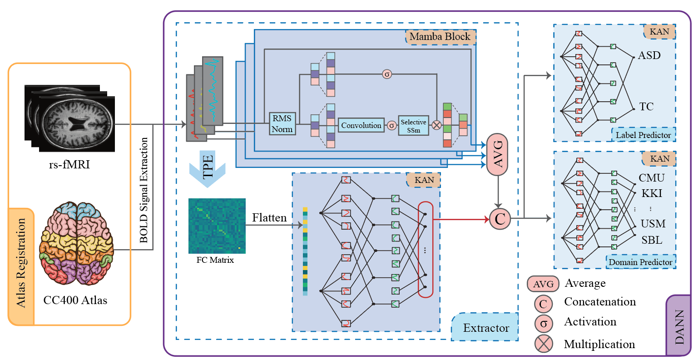

# Domain-Invariant Autism Classification using DANN, Mamba, and KAN
📢 This work has been accepted for publication at the 47th Annual International Conference of the IEEE Engineering in Medicine and Biology Society (EMBC 2025).

Citation:
F. G. Ladani, N. Karimi, B. Mirmahboub, Z. Sobhaninia, S. Shirani, S. Samavi,
"Using fMRI Time Series and Functional Connectivity for Autism Classification: Integrating Mamba and KAN in Domain-Adversarial Neural Networks,"
Proceedings of the 47th IEEE EMBC, 2025.

## 🧠 Method Description

Domain differences in fMRI analysis often cause biases that negatively affect Autism classification. To address this issue, we propose a novel method based on a **Domain Adversarial Neural Network (DANN)** architecture designed to extract **domain-invariant yet classification-informative features**.

The proposed framework includes:
- An **extractor** with two parallel paths:
  - The first processes **fMRI time series** using the **Mamba** model.
  - The second analyzes **functional connectivity** data using the **Kolmogorov-Arnold Network (KAN)**.
- The features from both paths are **concatenated** and used by:
  - A **label classifier** based on KAN.
  - A **domain classifier**, also using KAN, trained adversarially to encourage domain invariance.

Through adversarial training, the domain classifier is optimized to fail at distinguishing domain labels, thereby ensuring that the extracted features are robust across different domains while maintaining strong classification performance.

**Experimental Results**:
- Accuracy: **72.56%**
- AUC: **72.46%**

Our model performs comparably to state-of-the-art methods that rely solely on fMRI data—without the need for additional phenotype information.

---

## 📊 Pipeline Overview

The full architecture is illustrated below:

---

## 📁 Data Description

The dataset used in this project consists of:
- **fMRI time series data** for each subject.
- **Functional connectivity matrices** derived from the fMRI data.
- Each subject's data is associated with a domain label (e.g., site ID) and a class label (ASD vs. control).

To run the project, users need to **download the datasets from the following link**:  
👉 [Connectivity Matrices Data Link](https://drive.google.com/file/d/1LNJOwRnShxbR7C-3O3vhtT13dl6PS-4R/view?usp=sharing)
👉 [fMRI Time Series Data Link](https://drive.google.com/file/d/1OuW1yduHg4AN6ECPKs3ahZOppKRObGBh/view?usp=sharing)

Once downloaded, the data should be uploaded into the Colab environment or mounted via Google Drive for seamless integration.

---

## ⚙️ Runtime Environment

This project is designed to be run in **Google Colab** with access to an **NVIDIA A100 GPU** for optimal performance.  

